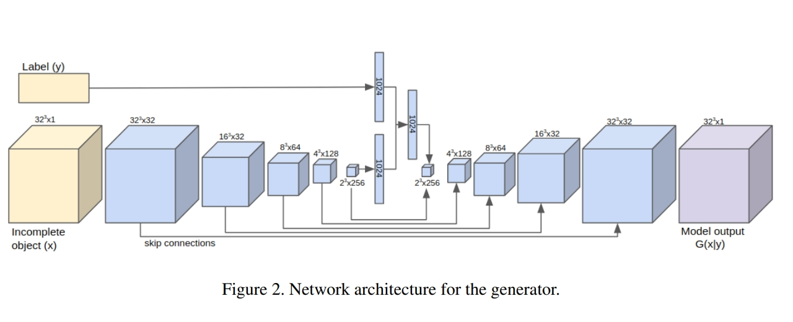
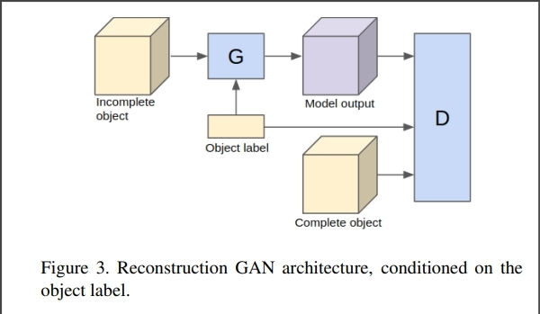
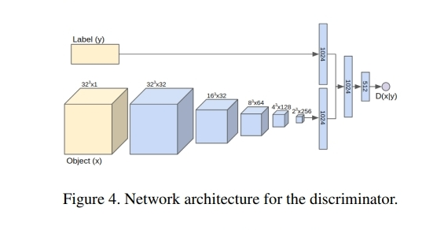

# Part1 Introduction

The topic we choose for our final project is *Let's Make Pottery: GANS for Voxel Completion in Ancient Pottery Dataset* whose Quizmaster is class TA YuXuan, Luo.

This project mainly revolves around building a GAN that takes fragmented artifacts' voxel representation as input and outputs the missing part of the corresponding piece. Hopefully, our model can provide great assistance to pottery reconstruction work for archaeological studies. 

Till the middle checkpoint, we've successfully visualized the dataset, implemented the strengthened data-loader and constructed the structure of a naive GAN which can smoothly compile and train. For further improvement, we manage to train it on a larger basis to collect long-term data of its performance and visualize its output. We've conducted several ablation studies as well in order to gain in-depth insights into exactly how each component of our model functions. Eventually, we have generalized our model to $64^3$ resolution and derived our own loss functions to improve the reconstruction performance. Multiple evaluation metrics measuring model recall and precision have also been designed for the sake of quantitative analysis.
# Part2 Related Works

### (1) GAN based models

*Basic GAN model (Goodfellow et al., 2014)* consists of two parts: generator and discriminator. In the first version, both the generator and the discriminator are MLPs. The advanced GANs make many modifications to the model structure, such as

- using CNNs - which is called *DCGAN (Radford et al., 2015)*;
- using Varation-Auto-Encoder - which is called *VAE-GAN (Larsen et al., 2015)*;
- changing loss function from JS divergence to Wasserstein loss - which is called *WGAN (Arjovsky et al., 2017)*.

These modifications focused on higher ability and better stability. Another kind of modification concerns how to generate higher resolutions and bigger results. One basic way is to adding new structure and stronger computation, such as

- *SA-GAN (Zhang et al., 2018)* using self-attention;
- *SN-GAN (Miyato et al., 2018)* using spectral normalization;
- *bigGAN (Brock et al., 2018)* using bigger batch size.

Some method changes the way the model works, including
- using progressive scale-growing GANs, which is called *ProGAN (Karras, 2017)*;
- using progressive pixel-growing models, which is called *PixelCNN (Oord et al., 2016)* (this is not a GAN, but a kind of generative model, so we put here).

Another way of improvement is adding controls to the result, such as *cGANs (Mirza et al., 2014)*, *styleGANs (Karras et al., 2018)*.

### (2) main paper introduction

There're two main papers we consider important, namely *Generative Adversarial Nets (Goodfellow et al., 2014)* and *3D Reconstruction of Incomplete Archaeological Objects Using Adversarial Network (Hermoza et al., 2018)*. Both papers have provided us with much reference and experience to rely on.

From the first paper, we've learnt the essence of a GAN which is a combination of a generative model G that captures the data distribution, and a discriminative model D that estimates the probability that a sample came from the training data rather than G. We've also gone through the mathematics foundation of the global optimality and convergence of a GAN-based algorithm, from which we derived several training strategies including alternating between the training of D and G. The paper also opens our minds to further improvement of GAN structure such as introducing a variational auto-encoder in the generator to allow for the learning of the conditional variance.

The second one mainly illustrated a variant of GAN, namely the ORGAN(OR is short for object reconstruction). It gave detailed description regarding its structure(a 3D CNN with skip-connections as a generator on a Conditional GAN (CGAN) architecture) and optimization targets(a mean absolute error (MAE) and an Improved Wasserstein GAN (IWGAN) loss) in additional to training details including the choice of hyper-parameters. Nevertheless, the dataset we use is quite different from this paper, which pushes us to design our own data-loader and consequently,  the exact training techniques  may need further experiments.

# Part3 Methods【复用+64】【mys-loss设置】
【模型】【配图：论文的图片（复用）】
### (1) Problem Definition
In a word, what we are going to do is to predict models of the complete pottaries, given models of the fragments. The 3D models are represented as voxels of shape $32\times32\times32$ or $64\times64\times64$.

It's worth noting that the task is a prediction task, instead of a generation task. The difference is that in out prediction task, the ground-truths are given, while in a generation task, they are not given. The task determined that our approach was fully-supervised.

Our task setting is almost the same as *"3D reconstruction of incomplete archaeological objects using a generative adversarial network" (Hermoza et al., 2018)*, with a slight difference that the inputs of our tasks were fragments (or combinations of fragments), while in Hermoza (2018)'s work, the inputs were randomly sampled from the complete models.

### (2) Model Setting

We build a generator32 and a discriminator32 in `utils/model.py` separately and combine them into a GAN in `training.py`. The generator takes the input fragments and the label and outputs the complete model. The discriminator takes the complete model and the label and outputs a score. It should be emphasized that label are needed for both the generator and the discriminator, which means that the GAN model we built is actually a conditional-GAN.

The generator is built as the picture shown: In the first branch we use 1 Encoder (named as encoderl) to convert the label into a 1024 dim feature vector. In the second branch, we use 5 sequentially connected Encoder layers (named encoder_i) to encode the input fragments into a 1024 dim feature vector. Then we concatenate these two convert them into a 1024 dim feature vector. After these step, we use 5 Decoder layers (named as decoder_i) to decode the feature vector into a 3D-voxel, which is the output of the generator. The discriminator is similar in the first two step, and convert the feature vector into a 1 dim feature vector, which is the final output of the discriminator.

<b>picture in the paper</b>

There're 2 points to note in this model: 
1. Every encoder follows not only the 'Conv-Act-Norm' paradigm, but also follows a SE-layer. Decoders are the same except for replacing the 'Conv-layer' with 'TransConv-layer'. Details parameters are in the picture.
2. The generator use 'skip connection' technique which means directly concatenating one feature map with a very late feature map. 
# Part4 Experiments
1. 【具体的参数怎么设置、训练过程】【mys】
2. Ablation Study【控制变量/对比实验】
	1. 测试输入为空，输出的结果是什么【xly】
		1. 【一个配图】
	2. 测试只训练gan的G部分，是否可以恢复模型【wmq】
		1. 【一个配图】
	3. 测试给gan的G部分的decoder投一个随机项链，是否可以生成结果【wmq】
		1. 【一个配图】
# Part5 results analysis
1. 通过指标比较两组模型的效果（wmq交两个模型，mys分析效果）
	1. ‘VAE vs GAN32 vs GAN64’
		1. 【一个表格】
2. title
	1. 测试同一个成品，随着输入碎片的数量增加，输出模型的变化【xly】
		1. 【一个表格+一个配图】
# Part6 Conclusion【mys】
