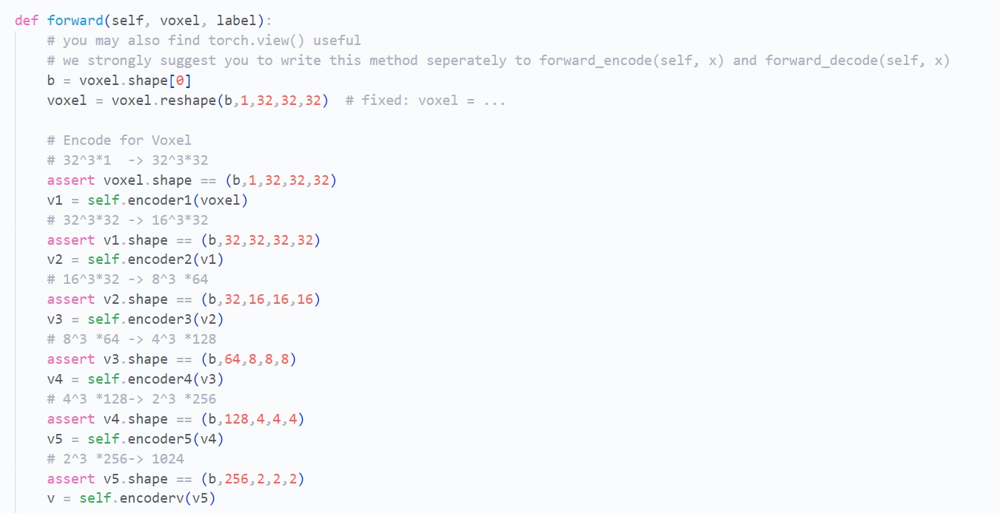
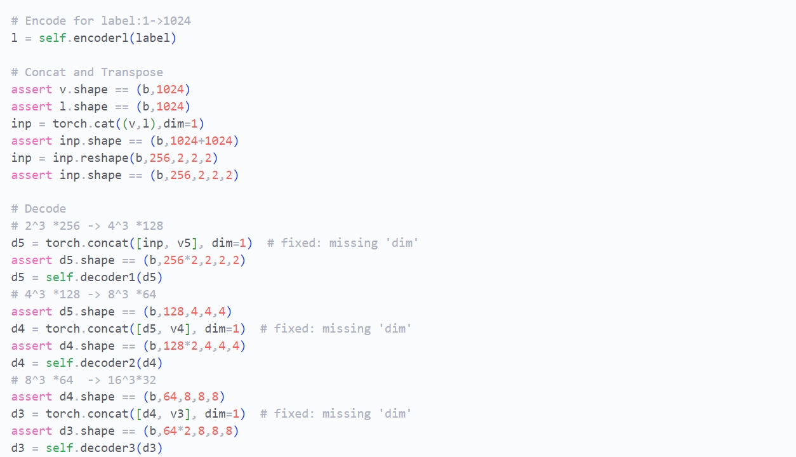
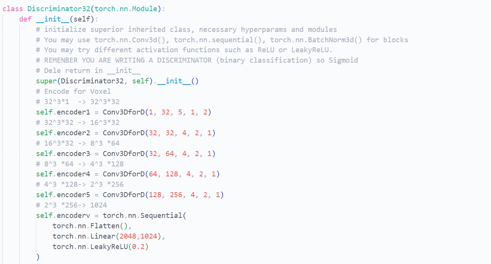
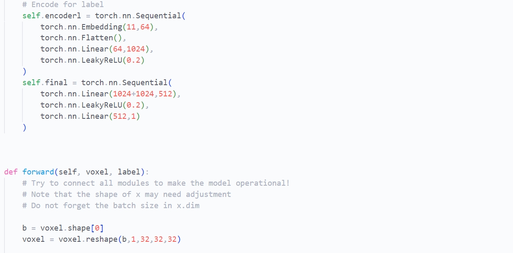

# CV大作业中期报告

2024.1.17 成员：xxx, xxx, xxx

## Part1 Introduction[xly]
(a brief introduction，such as“我们选择的题目是xxx，经过xxx时间我们目前完成了xxx内容、达到了xxx效果，后续计划完成xxx”)

## Part2 Related Works

### (1) GAN based models[wmq]

Basic GAN model[https://arxiv.org/abs/1406.2661] consists of two parts: generator and discriminator. In the first version, both the generator and the discriminator are MLPs. The advanced GANs make many modifications to the model structure, such as using CNNs --- which is called DCGAN[https://arxiv.org/abs/1701.07875], using Varation-AutoEncoder --- which is called VAE-GAN[https://arxiv.org/abs/1406.2661], changing loss function from JS divergence to Wasserstein loss --- which is called WGAN[https://arxiv.org/abs/1701.07875]. These modifications focused on higher ability and better stablity. Another kind of modification concerns how to generate higher resolutions and bigger results. One basic way is to adding new structure and stronger computation, such as SA-GAN[https://arxiv.org/abs/1805.08318] using self-attention, SN-GAN[https://arxiv.org/abs/1802.05957] using spectral normalization, bigGAN[https://arxiv.org/abs/1809.11096] using bigger batch size. Some method changes the way the model works, including using progressive scale-growing GANs, which is called ProGAN[https://arxiv.org/abs/1710.10196]; using progressive pixel-growing models, which is called PixelCNN[https://arxiv.org/abs/1606.05328](this is not a GAN, but a kind of generative model, so we put here). Another improving way is adding controls to the result, such as cGANs[https://arxiv.org/abs/1411.1784], styleGANs[https://arxiv.org/abs/1812.04948].

### (2) main paper introduction[xly]

- introduce the first two papers mentioned in writeup

Till now, we've read the first two papers mentioned in writeup, namely *Generative Adversarial Nets* (Goodfellow, 2014) and *3D Reconstruction of Incomplete Archaeological Objects Using Adversarial Network* (Hermoza, 2018).

From the first paper, we've learnt the essence of a GAN which is a combination of a generative model G that captures the data distribution, and a discriminative model D that estimates the probability that a sample came from the training data rather than G. We've also gone through the mathematics foundation of the global optimality and convergence of a GAN-based algorithm, from which we derived several training strategies including alternating between the training of D and G. The paper also opens our minds to further improvement of GAN structure such as introducing a variational auto-encoder in the generator to allow for the learning of the conditional variance.

The second one mainly illustrated a variant of GAN, namely the ORGAN(OR is short for object reconstruction), drawing a fundamental picture of 3D GAN. It gave detailed description regarding its structure(a 3D CNN with **skip-connections**, as a **generator** on a Conditional GAN (CGAN) architecture. With two optimization targets: a mean absolute error (MAE) and an Improved Wasserstein GAN (IWGAN) loss) in additional to training details including the choice of hyper-parameters, which provided us with much reference and experience to rely on. Nevertheless, the dataset we use is quite different from the latter paper, which pushes us to design our own dataloader and consequently the exact training techniques need further experiments.

## Part3 Our Approach

### (1) Problem Definition
In a word, what we are going to do is to predict models of the complete pottaries, given models of the fragments. The 3D models are represented as voxels of shape $32\times32\times32$ or $64\times64\times64$.

It's worth noting that the task is a prediction task, instead of a generation task. The difference is that in out prediction task, the ground-truths are given, while in a generation task, they are not given. The task determined that our approach was fully-supervised.

Our task setting is almost the same as *"3D reconstruction of incomplete archaeological objects using a generative adversarial network" (Hermoza, 2018)*, with a slight difference that the inputs of our tasks were fragments (or combinations of fragments), while in Hermoza (2018)'s work, the inputs were randomly sampled from the complete models.

### (2) Model Setting[wmq]

model layer structure/hyper parameters/loss function/optimizer/training strategy
We build a generator32 and a discriminator32 in `utils/model.py` separately and combine them into a GAN in `training.py`. The generator takes the input fragments and the label and outputs the complete model. The discriminator takes the complete model and the label and outputs a score. It should be emphasized that label are needed for both the generator and the discriminator, which means that the GAN model we built is actually a conditional-GAN.

The generator is built as the picture shown: In the first branch we use 1 Encoder (named as encoderl) to convert the label into a 1024 dim feature vector. In the second branch, we use 5 sequentially connected Encoder layers (named encoder_i) to encode the input fragments into a 1024 dim feature vector. Then we concatenate these two convert them into a 1024 dim feature vector. After these step, we use 5 Decoder layers (named as decoder_i) to decode the feature vector into a 3D-voxel, which is the output of the generator. The discriminator is similar in the first two step, and convert the feature vector into a 1 dim feature vector, which is the final output of the discriminator.

    picture in the paper

    generator32 we build

    discriminator32 we build

    SE layer/Encoder/Decoder we build

There're 2 points to note in this model: 1. Every encoder follows not only the 'Conv-Act-Norm' paradiam, but also follows a SE-layer. Decoders are the same except for replacing the 'Conv-layer' with 'TransConv-layer'. Details parameters are in the picture. 2. The generator use 'skip connection' technique which means directly concatenanting one feature map with a very late feature map. 

## Part4 Working Details

### (1) Visualization[xly]
introduce what kind of visualization we did(maybe some pictures)

### (2) Data Processing
#### a) the raw data
The raw data contained the voxel models of the fragments. The models were not larger than $64\times64\times64$. Each voxel of the models either belonged to a unique fragment or was empty.

There were $11$ categories of pottaries indexed from $1$ to $11$. Each category contains several pottaries with different shapes, and for each pottary, voxel models of fragments with different number of fragments (at least $2$ and no more than $17$) are given.

#### b) pre-processing
To stack the voxel data into Torch arrays, we first padded the voxel models to ensure they were of the shape $64\times64\times64$. In detail, we check whether the size of the dimension is less than $64$ for each dimension. If so, we inserted zeros to the back of the dimension.

We implemented two settings. For the low-resolution setting, we downsampled the voxel models by sampling the voxels with even indices (i.e. $0,2,\dots,63$). For the high-resolution setting, we did nothing.

For the training stage, we first shuffled the data. For each voxel model, we randomly selected several pieces of fragments and combined them as the input and took the complete model as the ground-truth. We guaranteed that the input contains at least one piece and not all the pieces.

For the test stage, to make the results stable, we only randomly sampled the pieces for each voxel model in the first epoch. And in the following epochs, we reused the inputs in the first epoch.

#### c) analysis
The same complete models were divided into different sets of fragments, which meant there were sereral data with the same ground-truths. This might break the property of IID.

However, it also allowed us to strengthen the dataset by randomly combining the fragments as inputs. We could generate a large number of combinations for each pottary, which contributed to preventing overfitting.

### (3) Training Framework[wmq]

We used Pytorch to implement the training framework in training.py, named as `GAN_trainer`, shown in pictures below. In this model, we implements several functions, including args setting, data loading, model loading, model saving, model initialization, G_training, D_training, loss_drawing. In the main function, we initialize the model, load the data, and start the training process. We adapted the popular training way: update D every time and update G every 5 times. For better visualization, we also implemented a color progressing bar in console.

    class GAN_trainer and some of its member functions

    left:training process;    right:loss picture in one trial 

    colorful progressing bar in console

### (4) Remote Environment Setting[xly]
introduce how to set up environment in remote server(mention this time, won't appear in final report)